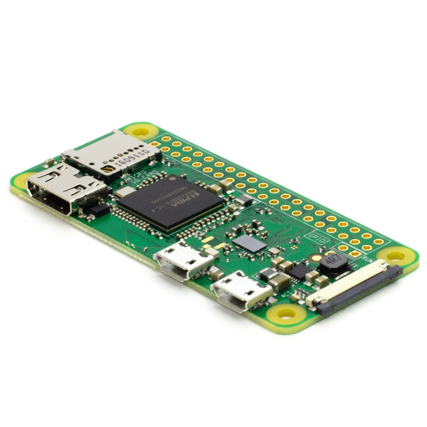
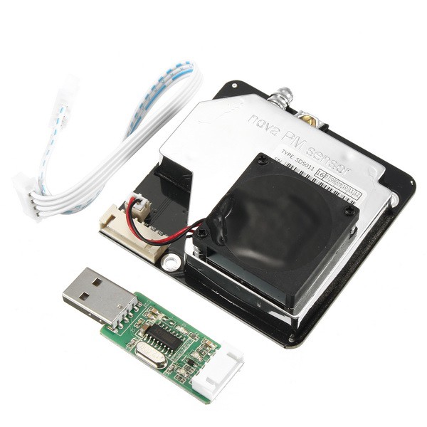
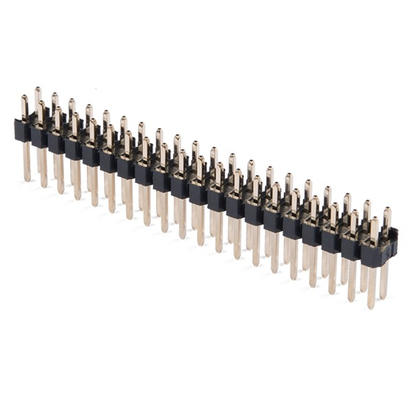
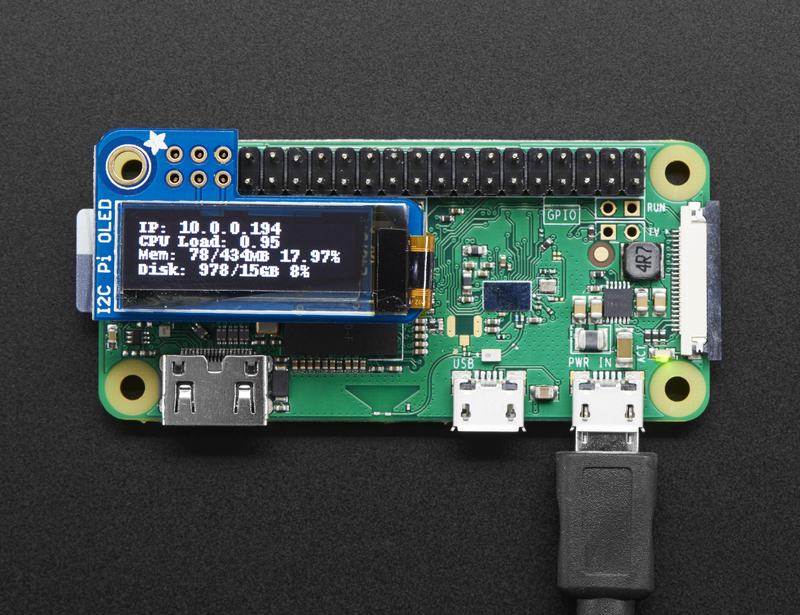
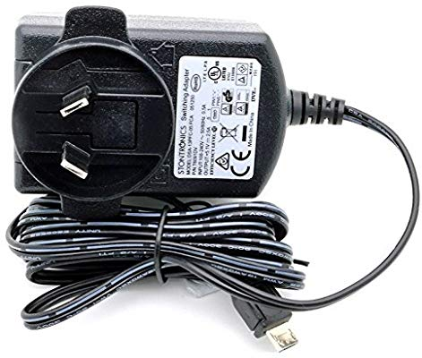

# aqi-pi
Measure AQI based on PM2.5 or PM10 with a Raspberry Pi and a SDS011 particle sensor. 
This package also displays AQI information on a Adafruit 128x32 Mini OLED device attached to the Pi. This allows the device to become portable when run from a portable USB power supply and not require WiFi or access to a web browser to see the results.


Original inspiration from Hackernoon's https://hackernoon.com/how-to-measure-particulate-matter-with-a-raspberry-pi-75faa470ec35 and the corresponding github: https://github.com/zefanja/aqi

Working
* Sensor of PM10 and PM2.5 measurements sensing and writing measurements to JSON file
* HTTP webpage displaying current sensor measurement 
* OLED Display (intended to display aqi result on local display to enable portable measurements)
* RESTful API (intended to access from Home Assistant (homeassistant.io))
* Home Assistant yaml configuration to read from RESTful interface

Not Working and on the TODO list: 
* Autostart of sensor and rest API (optional screen - don't want it on all the time..)
* HTTP webpage (plot.ly) displaying historic sensor measurements
* Understand and fix if neccesary the AQI definitions
* Migrate sensor code from Python2 to Python3
* Run code in python virtual environment
* Tidy up repo removing unused artifacts
* Publish to a public location, current plan is to http://sensor.community (also known as https://luftdaten.info/)
* Use a DHT11 or DHT22 to measure temp and humidity too
* Design a case for the devices, similar to: https://www.thingiverse.com/thing:3342804
* Abstract the serial port location using Watchdog: https://pypi.org/project/watchdog/


## Pre-Requisitites

### Hardware Required: 

* Raspberry Pi (In my case I used the Raspberry Pi Zero W, but should work with any version of Pi.) 

    
* An appropriate sized SD card - my card used about 1.5-2GB of it
* SDS011 Particulate Sensor

    
* Raspberry Pi Header that you'll have to solder on, (or just get the Pi Zero WH model that has it pre-soldered)

    
* Adafruit 128x32 Mini OLED device (Optional, enables readings on the device without WiFi or web browser)

    
* Micro USB Power Supply (for the Pi)

    

### Initial Software Setup

* Install raspbian on the pi.
* Optionally, configure the Pi to be headless by configuring wireless and enabling SSH  before inserting the SD Card into the Pi (https://www.raspberrypi.org/documentation/configuration/wireless/headless.md)
* Boot the Pi and SSH in.
* Clone this (or a forked copy) of this repo to your pi: 
```
git clone https://github.com/ugoogalizer/aqi-pi.git
```
* Copy the contents of the html directory into /var/www/html and install some python packages and a lightweight HTTP server
```
sudo cp ./html/* /var/www/html
sudo apt install python-serial python-enum lighttpd
```

## OLED Display Setup

Don't plug in the OLED display to your pi yet...

### Install Python Libs
On the raspberry pi (as per https://learn.adafruit.com/adafruit-pioled-128x32-mini-oled-for-raspberry-pi/usage)
```
sudo apt-get install python3-pip
sudo pip3 install adafruit-circuitpython-ssd1306 # Required for the display
sudo apt-get install python3-pil
sudo pip3 install flask # for the REST API
```

### Enable I2C and Serial Port on Raspberry Pi
As per: https://learn.adafruit.com/adafruits-raspberry-pi-lesson-4-gpio-setup/configuring-i2c

Use raspi-config to enable I2C Interface and install required testing software

```
sudo apt-get install -y python-smbus i2c-tools
sudo raspi-config
  > Interfacing Options
    > I2C
      > Enable: Yes
      > Default: Yes
    > Serial
      > Enable: Yes
      > Login Shell: No
  > Finish
sudo shutdown -h now
```

Now you can plug in the OLED to the display, then power it back on.

### Test I2C

Run: 
```
sudo  i2cdetect -y 1
```
You should see something like: 


## Run Everything

### Run the Sensor
Captures data from the SDS011 sensor and writes it to the JSON file (/var/www/html/aqi.json) used by the consuming scripts.
On the raspberry pi from the local copy of the git repo, run: 
```
sudo python2 ./python/aqi.py
```

### Run the Display: 
Displays the latest measurement from the sensor on the screen.
On the raspberry pi from the local copy of the git repo, run: 
```
sudo python3 ./python/display.py
```
CTRL+C quits the display (and now turns off the display rather than leaves it to run and burn out your screen)

### Run the RESTful Interface
Run a simple RESTful interface using Python3 and Flask that returns the latest sensor status in JSON format, intended for ingestion into Home Assistant (https://www.home-assistant.io/integrations/rest/) but could be ingested by other systems.
On the raspberry pi from the local copy of the git repo, run: 
```bash
sudo python3 ./python/restful_api.py
```

API is available at: http://0.0.0.0:81/aqi/v1.0/aqi and returns JSON: 
```json
{
  "pm25": 300.5, 
  "pm10": 70.0, 
  "time": "20.04.2019 17:04:05", 
  "pm10 AQI": 1, 
  "Overall AQI band": "low", 
  "Overall AQI": 1, 
  "pm25 AQI": 1
}
```

Inspiration for this REST implementation came from: https://auth0.com/blog/developing-restful-apis-with-python-and-flask/ and http://mattrichardson.com/Raspberry-Pi-Flask/


## Optional Steps

If you don't have a sensor yet and want to test without it, you can use the example data in the git repo by: 
```
sudo cp ./html/aqi-example.json /var/www/html/aqi.json
```
